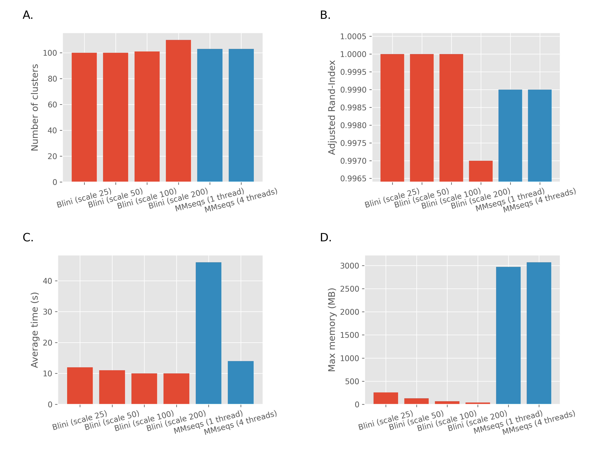
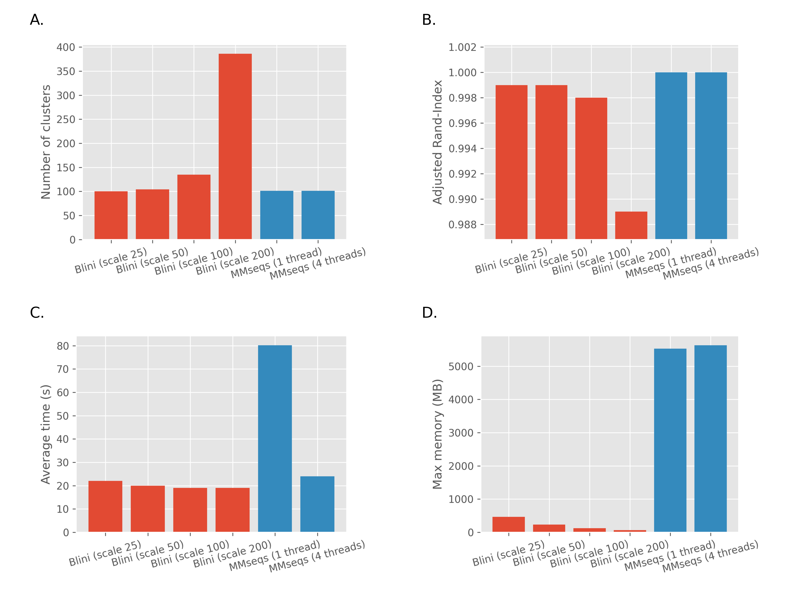

# Summary

Blini is a tool for quick lookup of nucleotide sequences in databases,
and for quick dereplication of sequence collections.
It is meant to help cleaning and characterizing large collections
of sequences that would otherwise be too big to search with
BLAST [@altschul1990basic] or too demanding for a local machine to process,
for example with Sourmash [@brown2016sourmash] or with MMseqs
[@steinegger2018clustering].
Blini is designed to be fast and have a small memory footprint,
while allowing the user to tweak its resource consumption
to improve matching resolution.
Finally, Blini is delivered as a single runnable binary,
with no need to install any additional software.

# Statement of need

Metagenomes are collections of genetic material from various organisms,
which are often not initially known.
Characterizing the taxonomic makeup of a sample involves searching
its contents in large databases in order to find which organism
matches each nucleotide sequence.
Assembled sequences can reach lengths of millions of bases,
making alignment-based search methods too cumbersome.
Such big queries are often outsourced to powerful cloud-based
services such as BLAST [@altschul1990basic].
In recent years, k-mer-based algorithms were introduced,
that enabled efficient searching in large datasets on local machines.
Mash distance [@ondov2016mash] introduced an alignment-free estimation
formula for average nucleotide identity between sequences,
making sequence comparison linear.
Sourmash [@brown2016sourmash] uses fractional min-hashing in order to
create small representations of large sequences,
which allow for efficient searching and comparison.
The LinClust clustering algorithm [@steinegger2018clustering] uses
k-mer matching reduce the number of pairwise comparisons and achieve
linear scaling with the size of the input.

Blini combines insights from Mash, Sourmash, and LinClust
into a simple tool that can quickly cluster or look up big collections
of sequences using estimated identity or containment,
with tweakable estimation resolution (similar to Sourmash's *scale*).

# Performance comparison

## Search

The search function was tested on RefSeq's viral reference
[@pruitt2007ncbi].
100 viral genomes were randomly selected for the test.
The algorithms were then run on the 100 genomes as queries,
and the original database as reference.
Each algorithm was expected to match each genome with its source
in the database.
In a second run, random SNPs were introduced to 1% of the genomes'
bases, and the same test was rerun.
For each test, the number of matches with sequences other than
the query's source was also measured.
The times shown here do not include reference-preprocessing time.

## Clustering

The clustering function was tested on two simulated datasets
created from the 100 chosen genomes of the previous test.
In one dataset each sequence had multiple counterparts with random SNPs.
In the second dataset random fragments were extracted from
each root sequence.
In the SNPs dataset, each of the 100 original sequences had another 100
mutated counterparts.
Each counterpart had random SNPs in 1% of its bases.
In the fragments dataset, each of the 100 original sequences
had 300 random fragments extracted from it,
of length of at least 1000 bases.

The algorithms were expected to group each sequence with its mutated
counterparts or with its fragments.
Performance was evaluated using the Adjusted Rand Index (ARI).
Blini's *scale* refers to the fraction of k-mers considered
for the operation.
Scale 50 means that 1/50 of k-mers were used.

{width=75%}

{width=75%}

# Limitations

Blini is designed to work on sequences ~20 times longer than
the selected *scale* value.
For the default value of 100,
sequences shorter than 2000 are likely to be falsely missed.
While the scale can be tweaked,
this tool might not be suitable for short reads.

Blini currently only works for nucleotide sequences.
Amino acid sequences might be added in the future.

Blini is currently single-threaded.
Multithreading can be considered in the future if a concrete need arises.

# References

